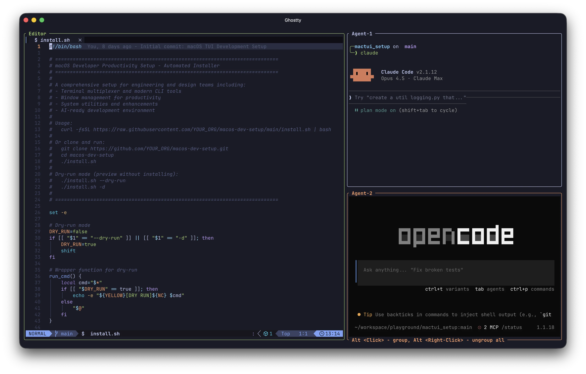
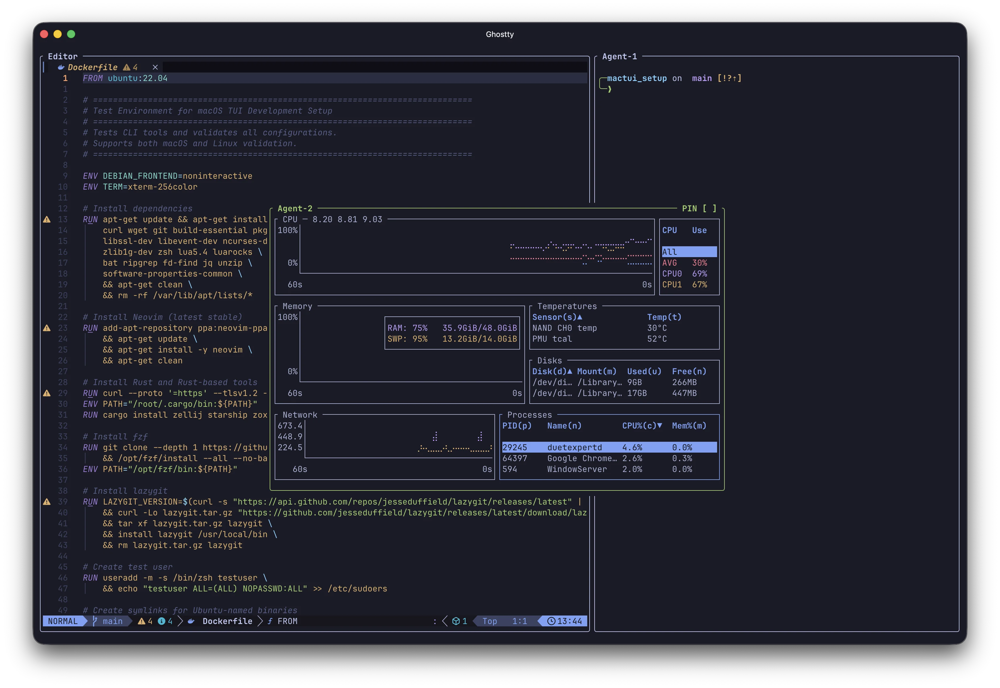
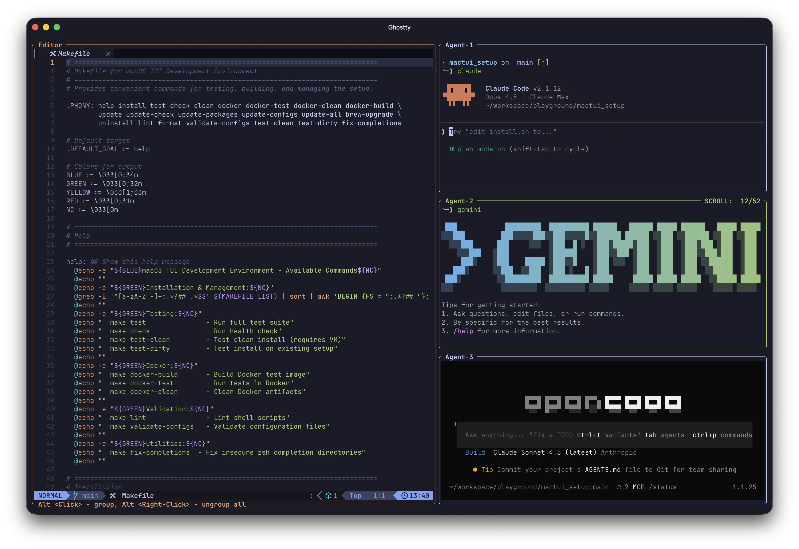
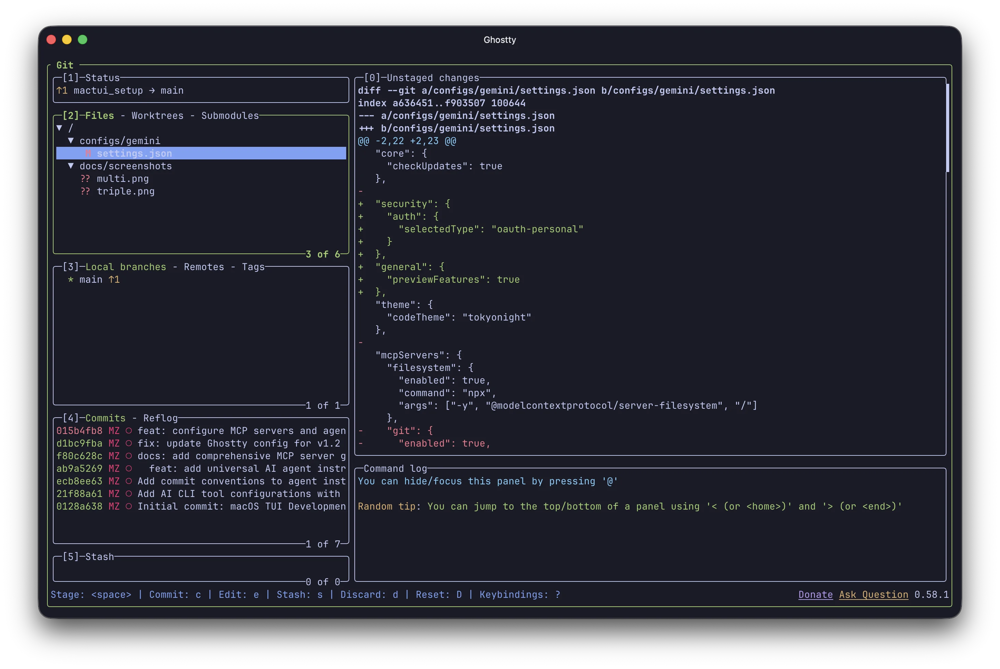
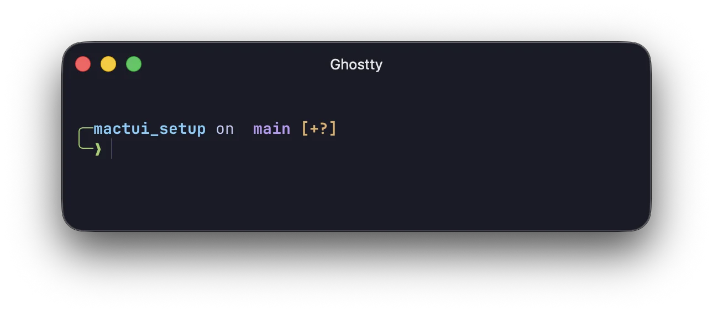

# macOS TUI Development Setup

> Terminal-first, AI-powered engineering productivity setup

> **Sponsored by [SpiceFactory](https://spfr.co)** — Building AI-powered developer tools


[](https://github.com/spfr/tuidev)

## Philosophy

- **Terminal-First** - No GUI IDEs, maximum speed
- **AI in Side Terminals** - Keep editor fast, use AI tools in parallel panes
- **Remote-Ready** - Work from phone/tablet anywhere
- **Opinionated** - Pre-configured, just works

---

## Preview

### AI Workflow — Editor + Agents Side by Side

*Nvim (60%) with two AI agent terminals (40%) — run `ai` to launch*

### Multi-Agent Layout with Tabs

*Development + Monitoring + Git tabs — run `multi` to launch*

<details>
<summary><strong>More Screenshots</strong></summary>

### Triple Agent Layout

*For heavy AI workloads — run `ai-triple`*

### Neovim with LazyVim

*Full IDE experience with LSP, file tree, and Tokyo Night theme*

### Lazygit

*Visual git interface — run `lg`*

### Starship Prompt

*Rich prompt with git status, icons, and Tokyo Night colors*

</details>

---

## Quick Start

```bash
git clone https://github.com/spfr/tuidev.git
cd tuidev
./install.sh
source ~/.zshrc

# Start your first AI session
ai
```

**That's it.** You now have nvim on the left, two AI terminals on the right.

---

## The AI Workflow

The killer feature: **nvim + AI agent terminals side by side**

```
┌─────────────────────┬──────────────────┐
│                     │     Agent-1      │
│       Neovim        │   (opencode)     │
│      (editor)       ├──────────────────┤
│                     │     Agent-2      │
│                     │    (claude)      │
└─────────────────────┴──────────────────┘
```

### Session Commands

**Zellij sessions** (manual workspace layouts):

| Command | Layout | Use Case |
|---------|--------|----------|
| `ai` | nvim + 2 agents | **Default** - daily work |
| `ai-single` | nvim + 1 agent | Light workload |
| `ai-triple` | nvim + 3 agents | Heavy AI work |
| `fullstack` | 5 tabs | Full-stack development |
| `multi` | Dev + Monitor + Git | Complete workflow |
| `remote` | nvim + tunnel | Remote access |

**Tmux sessions** (Claude agent teams split-pane mode):

| Command | Layout | Use Case |
|---------|--------|----------|
| `tai` | nvim + 2 agents | Agent teams (split-pane) |
| `tdev` | nvim + agent + runner | 3-column dev layout |
| `tai-triple` | nvim + 3 agents | Heavy agent work |
| `ta [name]` | bare session | Quick attach/create |

---

## What's Included

### Core Tools

| Tool | Purpose |
|------|---------|
| **[Neovim](https://neovim.io/)** + LazyVim | Full IDE with LSP |
| **[Zellij](https://zellij.dev/)** | Terminal multiplexer (primary, workspace layouts) |
| **[tmux](https://github.com/tmux/tmux)** | Multiplexer companion (Claude agent teams split-pane) |
| **[Ghostty](https://ghostty.org/)** | Fast terminal emulator |
| **[Starship](https://starship.rs/)** | Shell prompt |
| **[nnn](https://github.com/jarun/nnn)** | TUI file manager (fastest) |
| **[yazi](https://github.com/sxyazi/yazi)** | Modern file manager (async) |
| **[lazydocker](https://github.com/jesseduffield/lazydocker)** | Docker TUI |

### Modern CLI Replacements

| Old | New | Improvement |
|-----|-----|-------------|
| `ls` | `eza` | Icons, git status |
| `cat` | `bat` | Syntax highlighting |
| `grep` | `ripgrep` | 10x faster |
| `find` | `fd` | Simpler syntax |
| `cd` | `zoxide` | Smart history |
| `sed` | `sd` | Intuitive syntax |

### Productivity

| Tool | What It Does |
|------|--------------|
| `fzf` | Fuzzy find anything |
| `lazygit` | Visual git |
| `lazydocker` | Docker TUI |
| `btm` / `bottom` | System monitor |
| `glow` | Render markdown |
| `delta` | Better git diffs |
| `broot` | Directory navigator |
| `tldr` | Command examples |
| `fastfetch` | System info |
| `ncdu` | Disk usage analyzer |
| `bandwhich` | Network monitor |
| `k9s` | Kubernetes TUI |

### macOS Apps

| App | Purpose |
|-----|---------|
| Rectangle | Window snapping |
| Hammerspoon | macOS automation |
| Stats | Menu bar monitor |
| Maccy | Clipboard history |

### AI CLI Tools

Pre-configured with MCP (Model Context Protocol) servers:

| Tool | Config | Purpose |
|------|--------|---------|
| Claude Code | `~/.claude.json` | Anthropic's official CLI |
| OpenCode | `~/.config/opencode/opencode.json` | Open-source, multi-model support |
| Gemini CLI | `~/.gemini/settings.json` | Google's Gemini CLI |

**MCP Servers (enabled by default):** `filesystem`, `git`, `fetch`, `memory`

**Optional (requires API keys):** `github`, `brave-search`, `figma`, `postgres`, `sqlite`, `playwright`

```bash
# Configure API keys
cp ~/.config/mcp-env.template ~/.config/mcp-env
nvim ~/.config/mcp-env
source ~/.config/mcp-env
```

### AI Agent Orchestration (Ralph Wiggum)

Run AI agents autonomously until tasks complete:

```bash
# Simple task
ralph "Fix all TypeScript errors in src/"

# With specific agent and limits
ralph --agent opencode --max-iterations 10 "Add unit tests"

# From task file (PRD-driven development)
ralph --file tasks.md --max-iterations 30
```

See [AI_ORCHESTRATION.md](docs/AI_ORCHESTRATION.md) for the full guide.

### AI Agent Instructions (AGENTS.md)

Universal instructions for AI coding assistants. Works with:
- Claude Code, OpenCode, Gemini CLI
- Cursor, Windsurf, Aider, Cline
- GitHub Copilot, Roo Code, Codex

**For your own projects:**

```bash
# Copy the template to your project
cp templates/AGENTS_TEMPLATE.md ~/myproject/AGENTS.md

# Create symlinks for all AI agents
./scripts/setup_agent_configs.sh ~/myproject
```

This creates symlinks so all AI agents read the same instructions:
`CLAUDE.md`, `.cursorrules`, `.windsurfrules`, `.aider.md`, etc.

---

## Essential Commands

### Navigation

```bash
z project       # Jump to directory (zoxide)
Ctrl+T          # Find files (fzf)
Ctrl+R          # Search history (fzf)
```

### Zellij

```bash
Alt+h/j/k/l     # Move between panes
Alt+n           # New pane
Ctrl+t, n       # New tab
Ctrl+o, d       # Detach session
```

### Neovim

```bash
Space f f       # Find files
Space f g       # Search in files
Space e         # File explorer
g d             # Go to definition
K               # Hover docs
```

### Git

```bash
lg              # Launch lazygit
gs              # git status
```

---

## Documentation

| Guide | Description |
|-------|-------------|
| [**QUICK_START_GUIDE**](docs/QUICK_START_GUIDE.md) | 5-minute crash course |
| [**AI_ORCHESTRATION**](docs/AI_ORCHESTRATION.md) | Ralph Wiggum autonomous agents |
| [**ARCHITECTURE**](docs/ARCHITECTURE.md) | How all pieces fit together |
| [**MCP_SERVERS**](docs/MCP_SERVERS.md) | Figma, Playwright, GitHub, etc. |
| [**NEOVIM_QUICKSTART**](docs/NEOVIM_QUICKSTART.md) | Full nvim/vim guide |
| [**CHEATSHEET**](docs/CHEATSHEET.md) | All keybindings |
| [**TERMINAL_NAVIGATION**](docs/TERMINAL_NAVIGATION.md) | Fix keyboard issues |
| [**REMOTE_SESSIONS**](docs/REMOTE_SESSIONS.md) | Work from phone |
| [**FAQ**](docs/FAQ.md) | Common questions answered |
| [**AGENTS.md**](AGENTS.md) | AI agent instructions |

---

## Remote Access

Work from anywhere - phone, tablet, any device:

```bash
# Start remote session
remote

# In Tunnel pane, start cloudflare tunnel
tunnel
```

Connect from your phone with SSH. See [REMOTE_SESSIONS.md](docs/REMOTE_SESSIONS.md).

---

## Configuration

### Theme

Everything uses **Tokyo Night** theme consistently:
- Neovim
- Zellij
- tmux
- Ghostty
- Starship
- fzf

### File Locations

```
~/.zshrc                     # Shell config
~/.config/nvim/              # Neovim (LazyVim)
~/.config/zellij/            # Zellij + layouts
~/.config/tmux/tmux.conf     # Tmux (agent teams companion)
~/.config/starship.toml      # Prompt
~/.config/ghostty/config     # Terminal
```

### Customization

```bash
# Personal shell additions (not overwritten)
~/.zshrc.local

# Custom nvim plugins
~/.config/nvim/lua/plugins/custom.lua

# Custom zellij layouts
~/.config/zellij/layouts/
```

---

## Validation & Testing

```bash
# Validate all configs
make validate

# Health check
make check

# Full test suite
make test

# Docker test (CI)
make docker-test
```

---

## Maintenance & Updates

```bash
# Check for updates (preview what would change)
make update-check           # or: ./scripts/update.sh --check
tui-check                   # shell alias

# Update everything interactively
make update                 # or: ./scripts/update.sh
tui-update                  # shell alias

# Update packages only
make update-packages

# Update configs only (syncs from repo)
make update-configs

# Update non-interactively (CI/automation)
make update-all

# Neovim plugins
nvim -c 'Lazy update' -c 'quit'

# Fix zellij sessions
zk                          # Kill all sessions

# Fix nvim plugins
rm -rf ~/.local/share/nvim
nvim                        # Reinstalls
```

The update system checks:
- **Packages**: Outdated brew packages (shows current → new version)
- **Configs**: Differences between repo and installed configs
- **Repository**: New commits available from remote

---

## Project Structure

```
tuidev/
├── configs/
│   ├── nvim/               # LazyVim config
│   ├── zellij/layouts/     # 7 workspace layouts
│   ├── tmux/tmux.conf      # Tmux config (agent teams)
│   ├── zsh/.zshrc          # Shell config
│   ├── starship/           # Prompt
│   ├── ghostty/            # Terminal
│   ├── opencode/           # OpenCode CLI + MCP
│   ├── claude/             # Claude Code + MCP
│   ├── gemini/             # Gemini CLI + MCP
│   └── mcp/                # Shared MCP env template
├── docs/                   # Guides
├── templates/
│   └── AGENTS_TEMPLATE.md  # Template for your projects
├── scripts/
│   ├── validate_configs.sh # Config validation
│   ├── health_check.sh     # System check
│   ├── test_suite.sh       # Full tests
│   └── setup_agent_configs.sh  # AI agent symlinks
├── AGENTS.md               # Universal AI agent instructions
├── CLAUDE.md               # Claude Code project guidance
├── install.sh              # Installer
├── Makefile                # Dev commands
└── Dockerfile              # CI testing
```

---

## Contributing

See [CONTRIBUTING.md](CONTRIBUTING.md) for guidelines.

---

## License

MIT — see [LICENSE](LICENSE)

---

**Sponsored by [SpiceFactory](https://spfr.co)** | **Start coding:** `ai`

